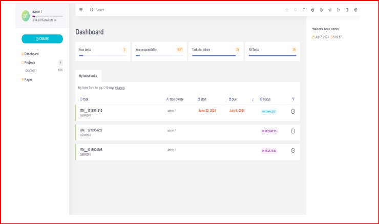

<h1>ProjectPilot</h1>

<h2>Introduction</h2>

    <strong>ProjectPilot</strong> is designed to revolutionize the way teams manage projects by offering an integrated, user-friendly platform that enhances collaboration, streamlines task management, and provides real-time updates. Our goal is to simplify project management and help teams achieve their goals more efficiently.

    <li><strong>Deployed Site</strong>: <a href="link-to-deployed-site">Link to deployed site</a></li>
    <li><strong>Final Project Blog Article</strong>: <a href="link-to-blog-article">Link to blog article</a></li>
    <li><strong>Authors' LinkedIn</strong>: <a href="link-to-linkedin-nouhaila">Nouhaila Ait Hammad</a>, <a href="link-to-linkedin-sabri">Sabri Chihab Eddine</a></li>
</ul>

<h2>Installation</h2>
<pre>
<code>
git clone https://github.com/Chihab2023/PROJECTPILOT.git
cd PROJECTPILOT
npm install
npm start
</code>
</pre>

<h2>Usage</h2>
<ol>
    <li>Open your browser and navigate to <code>https://projectpilot.wuaze.com/</code>.</li>
    <li>Register or log in to your account.</li>
    <li>Create a new project or join an existing one.</li>
    <li>Use the task management tools to assign tasks, set deadlines, and track progress.</li>
    <li>Collaborate with your team using the integrated real-time chat and notifications.</li>
</ol>

<h2>Contributing</h2>
<ol>
    <li>Fork the repository.</li>
    <li>Create a new branch (<code>git checkout -b feature-branch</code>).</li>
    <li>Make your changes.</li>
    <li>Commit your changes (<code>git commit -m 'Add some feature'</code>).</li>
    <li>Push to the branch (<code>git push origin feature-branch</code>).</li>
    <li>Open a pull request.</li>
</ol>

<h2>Licensing</h2>

This project is licensed under the MIT License - see the <a href="LICENSE">LICENSE</a> file for details.

<h2>Screenshot</h2>

<h2>Video and Photos</h2>

For a more immersive experience, check out our <a href="https://youtu.be/MSaiSX1lFKo?si=0PDEbgeFI0Grst0H">landing page video</a> which showcases the key features of ProjectPilot.

Here are some photos demonstrating our application's interface and functionality:

<h2>Clean Up Those Commit Messages</h2>

We reviewed all commit messages to ensure they are clear and informative. You can edit commit messages on GitHub by following these steps:

<ol>
    <li>Identify the commit to change: <code>git log</code>.</li>
    <li>Reword the commit message: <code>git commit --amend</code>.</li>
    <li>Push the change: <code>git push --force</code>.</li>
</ol>

<h2>(Re)Organize Your Files</h2>

We cleaned up unnecessary files, including temp files, unused libraries, and pycache. Our project structure is now well-organized.

<h2>Refactor and Simplify</h2>

We refactored large functions and classes to ensure they have a single responsibility and are manageable.

<h2>Spruce Up Variable Names</h2>

All variable names have been updated to be descriptive and conform to naming conventions.

<h2>About the Authors</h2>

    <h3>Nouhaila Ait Hammad</h3>
    
Nouhaila is a passionate software engineer focused on frontend development and project management. She thrives on creating seamless user experiences and solving technical challenges.

    <ul>
        <li><a href="https://github.com/n1o2h">GitHub</a></li>
        <li><a href="https://github.com/Chihab2023/MVP.git">Deployed Project</a></li>
        <li><a href="https://youtu.be/MSaiSX1lFKo?si=0PDEbgeFI0Grst0H">Project Landing Page</a></li>
        <li><a href="https://www.linkedin.com/in/nouhaila-ait-hammad-400aa4284/">LinkedIn</a></li>
    </ul>

    <h3>Sabri Chihab Eddine</h3>
    
Sabri is an experienced backend developer with a keen interest in scalable solutions and efficient code. He has a strong background in API development and database management.

    <ul>
        <li><a href="https://github.com/Chihab2023">GitHub</a></li>
        <li><a href="https://github.com/Chihab2023/MVP.git">Deployed Project</a></li>
        <li><a href="https://youtu.be/MSaiSX1lFKo?si=0PDEbgeFI0Grst0H">Project Landing Page</a></li>
        <li><a href="https://www.linkedin.com/in/chihab-sabri-75946b4a/">LinkedIn</a></li>
    </ul>

</body>
</html>

